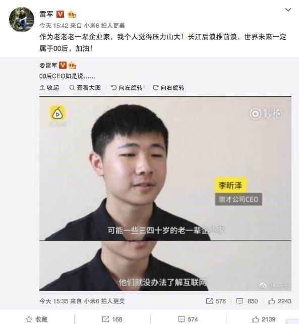
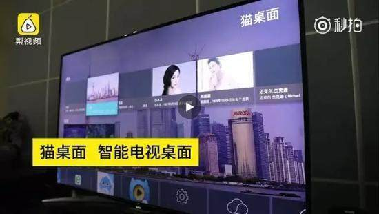

## 导言
## 程序员都喜欢抄袭“代码”，而且还拿着高薪？难道这么无法无天？？
你们知道程序员最熟悉，最熟练，最常用的两个快捷键是哪两个吗？没错，估计你现在心中所想的就是：ctrl+c 和 ctrl+v ，俗名为：复制和粘贴。
所谓，天下代码一大抄，亦不过在程序员心中就是复制和粘贴。那么这么做到底对不对呢？
## 让我们先来看一个案例
### 00后CEO陷“抄袭风波”  产品被指抄袭程序员作品

#### 引起热议的“00后CEO”
一则发布于9月2日的人物访谈视频几天来关注度越来越高，视频的主角名叫李昕泽，出生于2000年，他在2015年创业成立了一家公司，自己担任CEO。这是一家自称“00后第一公司”的科技公司，主要从事电脑桌面、APP、浏览器等产品的开发。视频中，这位年轻的创业者频爆金句：“可能一些三四十岁的老一辈企业家，他们就没办法了解互联网，因为已经老了”、“有非常多的人(质疑我的年龄)，但是没办法，我就是这么小就当了CEO，他们质疑也没办法。”

李昕泽自称，他的公司成立于他初三那年，目前有300多名员工，大多通过网络进行办公。李昕泽说，他的公司员工基本都是00后，最小的只有11岁。这段视频几天来热度持续走高，视频发布第二天，知名企业家雷军就通过个人微博转发了，并对这位00后CEO给予祝福和赞赏。

但很快，事情发生了变化。
#### 代码原作者现身指责抄袭
9月5日，网络架构师“墨镜猫”现身指责李昕泽，称他的产品抄袭了自己发布在开源网站Github上的开源代码。

在这篇名为《中国首位00后CEO公然抄袭、复制我的开源作品》的文章中，“墨镜猫”称，他是在9月4日晚上被别人提醒发现的这一情况。李昕泽在接受采访时所展示的智能电视项目中的“猫桌面”，正是自己发布在GitHub开源社区的一款产品。“一开始我还以为别人只是引用了我的作品什么的，但打开其中的链接却发现，不是那么简单，他(李昕泽)不但连我‘猫桌面’的名字都没改，连图片都没换。”

“墨镜猫”称，此前曾有多人向他申请独立运营该项目，自己不确定其中是不是有李昕泽，但可以肯定的是，自己明确拒绝了所有人，“由开源社区推动的产品，所有权属于大家，反对任何形式的独立。”

随着抄袭指责愈演愈烈，李昕泽在9月6日公开承认，他使用了“墨镜猫”的部分源代码，但声称曾获得“墨镜猫”的授权。“墨镜猫”对北京青年报记者表示，他从没有接到过李昕泽的任何联络。

在文章《中国首位00后CEO公然抄袭、复制我的开源作品》中，原作者引用视频采访中的截图和自己Github 项目中的效果图说明了李昕泽的完全照搬。

看起来还真是一模一样，照搬无误呢！

不过“墨镜猫”提到了一个词————开源代码，那么什么是开源代码呢？
## 什么是开源代码

开放源码软件(open-source)是一个新名词，它被定义为描述其源码可以被公众使用的软件，并且此软件的使用，修改和分发也不受许可证的限制。开放源码软件通常是有copyright的，它的许可证可能包含这样一些限制： 蓄意的保护它的开放源码状态，著者身份的公告，或者开发的控制。“开放源码”正在被公众利益软件组织注册为认证标记，这也是创立正式的开放源码定义的一种手段。————以上来自百度百科

      众所周知，所有的软件都用源码编写，并通过编译最终生成系统或应用。开放源码软件保证所有人可以得到这些代码。这意味着没有一个公司可以完全独占它。开放源码意味着自由选择的权力，而自由选择意味着激发更多创新的能量。
       它把控制权交还给使用者和客户。您可以查看系统运作的所有源码，或进行修改，或从中汲取相关的知识。系统缺陷和漏洞可以更快地被发现并加以修正。并且，当客户不满意一个供应商的服务，他们可以选择更好的服务提供商来建设他们的信息基础设施。没有技术的壁垒，也没有市场的垄断。     

        开源代码软件的前身——自由软件的创造者理查德.斯托曼（Richard M. Stallman）在1989年创建了GNU通用公共许可证（GPL）。这是首个版权许可证。它让用户有权使用、复制、分发和修改程序的源代码。但是，如果你更改了源代码并将其分发给其他人，你就必须共享修改后的代码。
#### 由此观之，“墨镜猫”原本好意分享“猫桌面”的源代码，但却被李昕泽直接作为公司产品展出。这不仅是对“墨镜猫”好意分享的侮辱，还是对原创者的蔑视。

#### 那么法律上是如何判定软件抄袭的呢？

## 法院中软件代码抄袭行为定性

在计算机著作权侵权案件中，原告主张被告侵犯了其软件著作权，其就应该对其所主张的事实进行举证证明。主要需要对如下事实进行举证：1、其对其主张的软件享有合法的著作权。2、其主张的享有著作权的软件与被控侵权软件对比达到实质性相似。3、被告有接触其软件程序的可能性。

在法院审理中，通常会要求被告提供全部源代码然后通过鉴定机构完成鉴定工作。需要强调的一点是，如果被告方拒绝提供源代码或者提供的源代码不符合鉴定要求导致无法对比，则判断侵权成立。在没有证据表明被告曾接触过原告软件的情况下，仍将提供被控侵权软件源代码的举证责任分配给被告。

而开源代码则会成为源代码抄袭认定的特殊因素，相同比例的界限也是模糊不清的，还需要法官根据具体情况作出判断。

## 总结
 其实能从千百万行代码中找到自己想用的那一段，稍作修改变成自己需要的功能，这本身就是一种于百万军中取上将首级的本事。若不对那段代码无比熟悉，至少架构了然于胸，不然他怎么抄？若不是基础比较扎实，经过了大量训练，他又怎么改呢？

 但是拿着别人的代码来解决自己的问题那才是本事。所谓天下代码一大抄，但是抄也应该正确的抄，也应该正确的用，在规则和许可下玩才行。不要在没声明的情况下，整体的复制粘贴到你的代码库里，不尊重作者。就比如开源库的使用，一般在应用中应该声明一下使用了哪些开源库，及开源许可证等信息。只要不违反原作者的版权协议，那么借鉴是完全可以的。
