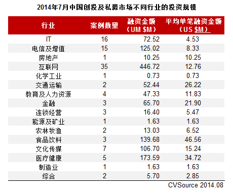

# 浅述IT与风投
## 什么是风投？
风险投资（英语：Venture Capital，缩写为VC）简称风投，又译称为创业投资，主要是指向初创企业提供资金支持并取得该公司股份的一种融资方式。

一般来说，风险投资都是投资于拥有高新技术的初创企业，这些企业的创始人都具有很出色的技术专长，但是在公司管理上缺乏经验。（好像跟IT行业很有联系呢）

## IT行业优势
从风投的概念中，我们可以看到，其投入的，大多是新兴技术，这是由于老牌技术的市场已经饱和，虽然可能较为稳定，但是伴随而来的还有低机遇。而it行业作为近几十年来的新兴行业，虽然中间有过些许的不景气，但大多数时间里，他是极其富有活力的，因而充满了机遇，这就吸引了资本家们的风险投资。

## IT风投现状与在中国的实例

由图可见，IT互联网产业是其他产业难以望其项背的。 
     
   
   2017年上半年，在新成立的230家公司中，大数据、云计算、人工智能等为代表的企业服务方向成为最热门的创业方向，相比去年同期最热的文化娱乐方向超出6个百分点。其热门之程度，令人叹为观止。 
  
 
 讲到IT风投，我们不得不把目光看向软银集团（Softbank）—— 一家主要致力于IT、网络和电信产业投资的公司。软银在全球投资过的公司已超过600家，在全球主要的300多家 IT 公司拥有多数股份。2017年6月，《2017年BrandZ最具价值全球品牌100强》公布，软件银行集团排名第95位。 

 最为我们所熟知的，当然是软银与阿里巴巴的深厚渊源。软银最早投资了中国最大的电子商务公司阿里巴巴。2004年2月，阿里巴巴再次从软银基金获得6000万美元的资金。而后，软银又一手导演阿里巴巴收购雅虎中国。日本软银集团2007年5月8日发布公告称，阿里巴巴集团董事局主席、时任CEO马云将成为软银集团董事会成员。马云此次受邀成为软银集团的第10位董事，参与软银的重大事件决策。

##
