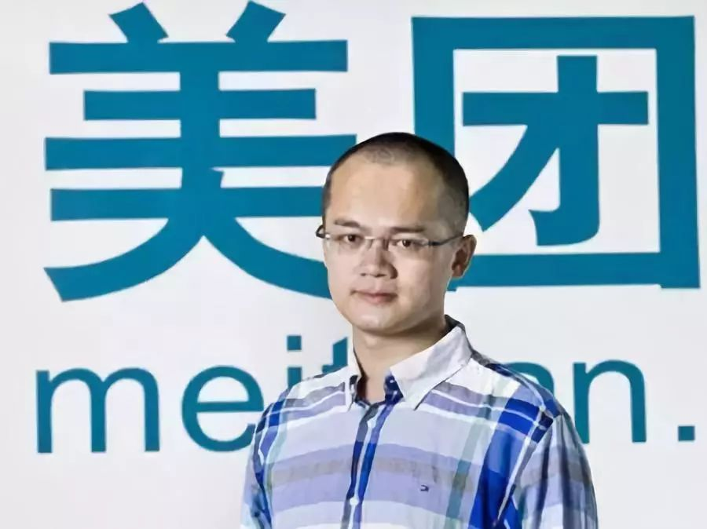
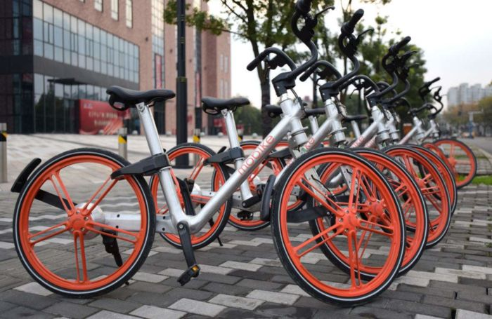
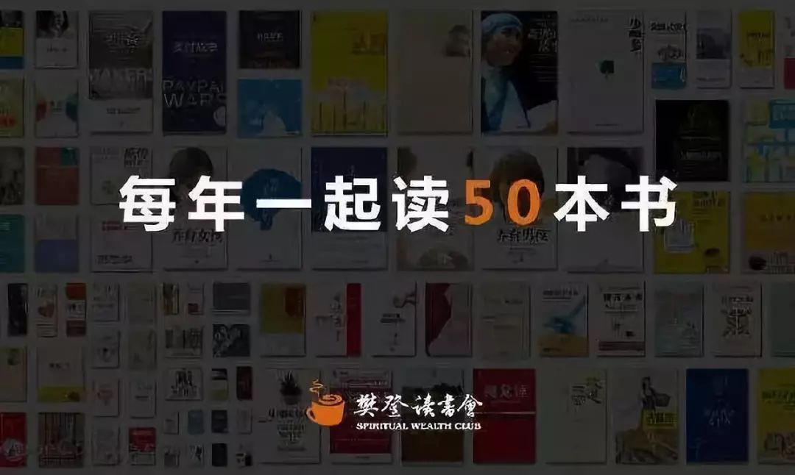
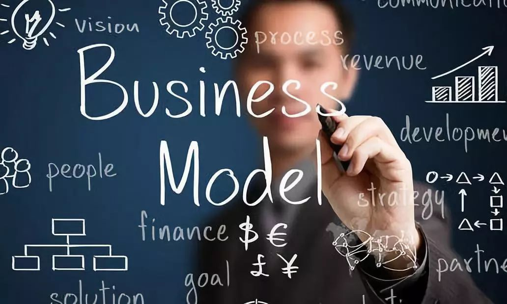

# 互联网盈利模式————流量变现
## 导言
4月3日，摩拜37亿美元卖给了美团。摩拜成立于2015年1月，37亿美元，用时3年。

5月3日，小米正式在港交所提交IPO招股书，估值700亿美元。小米成立于2010年，700亿美元，用时8年。

5月11日，蚂蚁金服将完成逾100亿美元融资，估值约1500亿美元。蚂蚁金服成立于2004年，1500亿美元，用时14年。

网传，滴滴最早今年IPO，目标估值700亿~800亿美元。滴滴成立于2012年，700亿美元，用时6年。

1998年被称为中国互联网的元年，搜狐、新浪、网易、腾讯这四大门户网站几乎都在那一年成立，当时互联网刚进入中国，大家还不知道通过互联网怎么赚钱，彼时谁都没想到，20年后，这几位互联网的先行者能够凭几台电脑进入福布斯中国百富榜。

## 那么互联网的盈利模式是怎样的呢？
盈利模式分为自发的盈利模式和自觉的盈利模式两种，早期的中国互联网并没有清晰的盈利模式，大家都在摸索尝试，很多靠卖广告勉强维持生计。

现如今，互联网的盈利模式越来越有规律可循，很多公司一开始就设计好产品清晰的盈利模式进入了自觉盈利，他们越来越有钱，财富积累的速度也越来越快。

### 在互联网时代，流量就是金钱，有了流量，有了用户，就不愁赚不到钱。
## 案例
案例一、美团外卖盈利模式

1.佣金抽成

向入驻的商家抽取一定的交易分成

2.平台增值服务

美团内的广告位如banner、推荐位、专题等-商家
用户画像、竞争情报等-商家
付费会员特权-用户

3.自营餐饮

平台掌握了所有商家的订单数据，知道在什么地段在什么时候卖什么最赚钱，这就是大数据。

4.资金池

每一周或者两周和商家进行结算。利用账期做沉淀资金的投资利用。

案例二、摩拜的盈利模式

1、押金池/资金池

一个用户的押金为299元，现在摩拜有多少个用户缴纳押金并没有数据披露。17年年初，有媒体报道说摩拜的用户押金池已经到数十亿，并且没有监管单位监管这笔钱，时过一年现在押金池里的资金数量到底多少钱，没有人知道。

这么多钱即便放在银行，按照4%的年收益，一年也有几千万，更何况摩拜会把钱放银行拿4%吗？

2、收费服务，分时租赁

骑行一次按照1元，一辆车一天被使用4次话，一年按照250天计算。一辆单车一年可贡献收入1000元，而一辆单车的造价为500~2000元（官方说是3000元），现在和富士康合作造车，新一代摩拜每车的造价应该低于1000元，一辆单车假如可以使用4年的话，一年即可回本，剩下3年即可净赚。

3、广告收入

一个拥有2亿用户的高频超级APP随便接个广告，收入也是非常可观的。合作过的客户有：万科地产、优衣库、1号店、京东、正义联盟大电影等。

4、电商卖货

摩拜一直在尝试更多的盈利方式，卖周边既是一种，在摩拜成就馆出售雨衣、手套、保温板、钥匙扣等产品，但效果差强人意。

注：摩拜单车居高不下的折损率、高昂的运维成本、快速拓城大量造车的成本要求公司有强劲的现金流支撑，这可能也是最后卖身的原因吧。

案例三、樊登读书会的盈利模式

1、收费服务

一年会费365元，给你讲50本书；付费课程服务

2、卖书

听了解读后不过瘾，想买本实体书回去看看，好的，书他们也卖。

3、在线下开书店，做传统生意

樊登这个IP现在有很大的号召力，于是在线下开始做起书店生意，采取加盟制，向加盟商收取5~10万元加盟费，还有一些额外的管理费、培训费等。

4、线下社群收费活动

各个城市代理拥有本地社群的管理权，可以每周组织一些同城活动，向社群成员收取一定的组织费。

## 总结

任何一个成熟的产品生态里，都不会仅有一种盈利模式，它一定是多元的。盈利模式做为商业模式里的一环，是一个企业可持续发展的基础，但也需要不断的变革和创新。