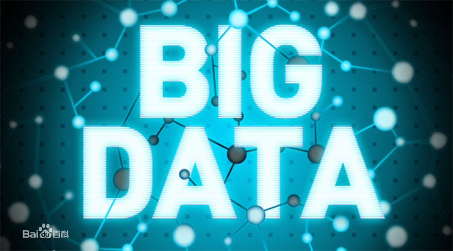

# 热点营销
快节奏的生活，信息化的时代，在我们的生活中充斥着众多的热点内容。热点营销，是指营销人及时地抓住广受关注的社会新闻、事件以及人物的明星效应等，结合品牌或产品在传播上达到一定高度而展开的一系列相关话题及活动。

# 当下IT热点
### ipv6

ipv4资源的日益短缺，目前已近到了最后时刻，几个帝国主义国家已近非常普及ipv6，而我泱泱大国在这块支持还远远不够，我们的高速公路可以，但是信息高速公路就没有那么好了。

### python

得益于大数据、人工智能的飞速发展，python语言越来越火爆，几乎干掉了所有的竞争对手。

### 大数据

大数据（big data），指无法在一定时间范围内用常规软件工具进行捕捉、管理和处理的数据集合，是需要新处理模式才能具有更强的决策力、洞察发现力和流程优化能力的海量、高增长率和多样化的信息资产。

一直以来，大数据与商业就密不可分。有了数据就能预测公众喜好，自然谁都想来分一杯羹。

### 自媒体

传统媒体从报纸、收音机、电视、门户网站不断的萎缩，自媒体更是个性的展现。

### 人工智能

人工智能（Artificial Intelligence），英文缩写为AI。它是研究、开发用于模拟、延伸和扩展人的智能的理论、方法、技术及应用系统的一门新的技术科学。

一些未来学家甚至预言，在一个并不遥远的未来，人工智能将和人类几无差别，成为真正的智能。而到那时，AI 带给我们的，究竟会是一个所有人性的罪恶都得到了救赎的“美丽新世界”？还是一个人类被其支配或毁灭的暗黑乌托邦？

### 区块链

一个新兴的技术方向，也许会是下一个互联网革命的方向。

### 物联网

万物互联，一个充满期待的未来。你，等着。

## 热点的选择？

要依据自己的产品定位以及目标客户群的界定，让热点为我所用，在热点的基础上突出要表达的优势。

# 营销方法
营销方法多种多样，在这里我介绍一种比较有意思的营销方法—————AI赋能营销

AI技术的价值最终体现在各个领域的落地应用上，比如医疗、教育、营销等。其中，智能营销早已成为营销界关注的重大课题：在营销成本日益提高的今天，智能营销如何帮助广告主降本增效？

### AI改变营销：从信息发布到信息匹配

以搜狗为例，它的无线自动化匹配体系基于AI技术，能让我们理解不同用户在不同场景下需要的东西到底是什么。比如电商场景，用户希望通过比价购买最好的东西；而在逛街时，则想找到附近最符合自己口味的餐馆；在查电影票时，希望直接买票或者看到影评。据了解，配备了自动化匹配体系的搜狗搜索商业产品，已覆盖到二十多个主要行业、包含四十多种展现形式。能够根据不同的用户需求，将二十亿广告物料进行更为契合的展示，并针对用户问题直接给出最契合的答案。

### AI助力营销：实现高效的精准对接

搜狗与京东的合作，就是人工智能基于电商场景为用户提供精准推荐的一次成功落地。

随着消费群体的逐渐细分，电商平台在引流时，越来越需要一个覆盖广泛的媒介和一支精细化运营团队，以针对不同消费群体的不同需求，给出更为精准的推荐。但是，对于电商平台来说，如何将数以亿计的用户以及不计其数的商品，实现更为契合和更为高效的精准对接，却是最大的挑战。

2017年，搜狗与京东展开战略合作，在人工智能具体如何赋能营销、提高营销效率方面提供了一个可视化的范本。

在这次合作中，首先要打通搜狗和京东数据的连接；然后打通双方产品库；最后，利用搜狗的智能化商业产品，推动京东的数百万件产品曝光。

在这个过程中，搜狗要对海量用户的商业意图进行深度识别，同时对京东商品库的每个商品物料进行细致分析，建立高亮图谱；最终给用户提供更加个性化的推荐，自动匹配更适合他的商品物料，这是搜狗最重要的个性化广告技术。京东“11.11”期间大家看到的50%的广告物料都是机器自动生成。个性化物料生成后，立刻结合搜狗全线产品进行上线推广。搜狗与京东的这次合作是其背后的技术基础已然是基于AI实现的智能匹配。

